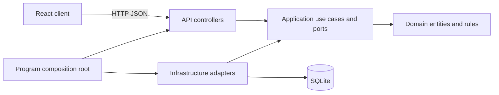

# Implementation walkthrough

## Problem and scope

A user needs a private list of tasks with title, description, status and due
date. The first version provides registration, login and complete task CRUD.
The assessment's user-management API is the authentication controller; the
second resource API is the task controller. Both run in one ASP.NET Core host.
The client is responsive React. SQLite keeps setup small and reproducible.

## Architecture

The arrows into Application describe source dependencies. At runtime,
TaskService calls ITaskRepository and dependency injection supplies the SQLite
adapter. This inversion lets use cases be tested without a database. Domain
and Application do not import Infrastructure. Concrete infrastructure is wired
in the composition root. No ORM, generic repository or mediator is used.

## Development decisions

1. Define the user story and ownership requirements before implementation.
2. Write failing tests for domain and use-case behavior, then implement those
   behaviors with small interfaces and immutable task records.
3. Exercise persistence against real SQLite; mocks alone cannot verify SQL
   parameters, uniqueness, foreign keys or owner filters.
4. Exercise authentication and controllers through a real in-process HTTP host.
5. Build forms and the HTTP adapter through failing frontend tests, then connect
   the screens and verify them in the browser.
6. Fix actual compiler, dependency and browser findings; retain their tests and
   describe the corrections in the GenAI record.

## Five-minute demonstration

- Run the API and frontend as described in README.
- Sign in with the demo account and show the seeded tasks.
- Create a task with a due date; edit its title and status.
- Show delete confirmation. Create a disposable task before demonstrating deletion.
- Register a new account and show that its task list starts empty.
- Explain the HTTP test that prevents a second user from reading, updating,
  deleting or listing another user's tasks.
- Show one domain test, one application test and one SQLite/HTTP test.
- Explain one real correction from GENAI.md and one version-one tradeoff.

## Limits and next steps

The exercise does not implement team sharing, billing, recurrence, real-time
notifications or infrastructure for multi-instance deployment. Sessions are
memory-only and expire after 30 minutes; sign-out does not revoke a stolen JWT.
Updates have no optimistic concurrency token. Offset pagination is adequate
for a small list but can shift during simultaneous writes. A production version
would need explicit migration, backup, deployment and session-lifecycle plans.

The code, tests, lockfiles and evaluator documentation are in this single repo.
No symlinks or external private source repositories are required.
