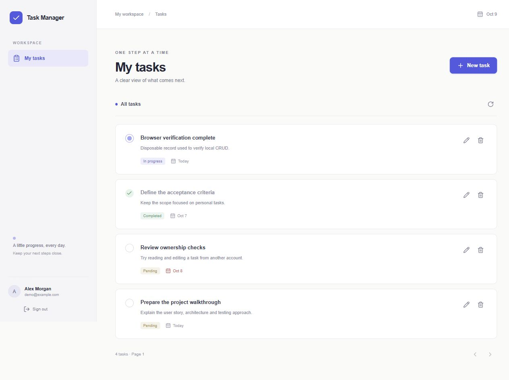
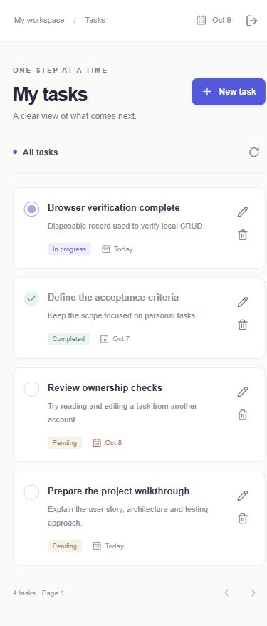
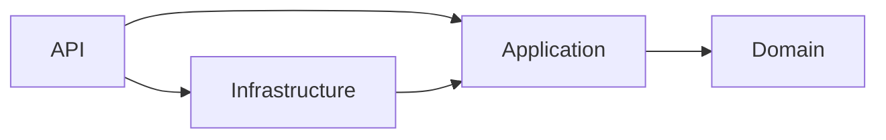
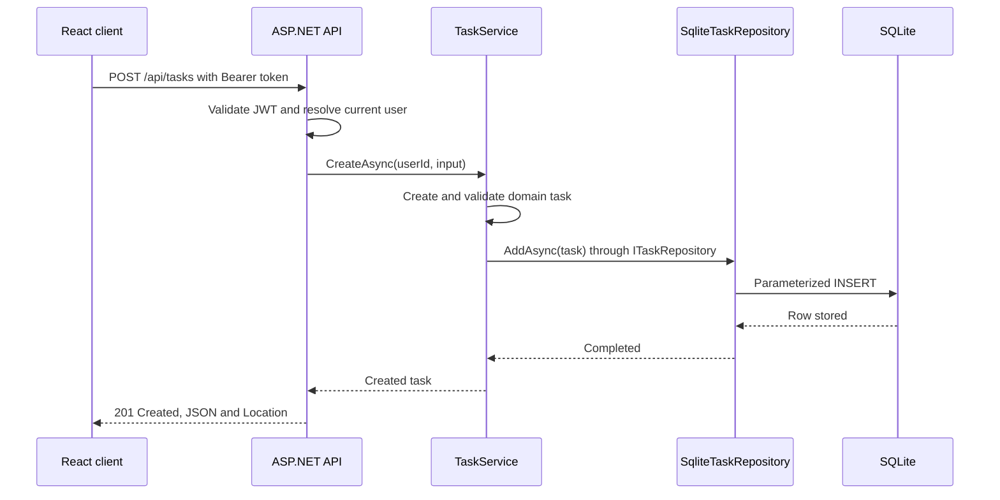

# Task Manager

A small task management application built with ASP.NET Core, React and SQLite.

## Preview

Desktop and mobile views of the local demo account after exercising task CRUD.
The screenshots include an additional task created during that walkthrough.





## User story

As a user, I want to register, sign in and manage my own tasks with a title,
description, status and due date so I can organize my work.

## Acceptance criteria

- Users can register and sign in.
- Authenticated users can create, read, update and delete their own tasks.
- A user cannot access another user's tasks.
- Invalid input produces actionable validation errors.
- The application includes demo credentials and seeded tasks.
- The interface works on desktop and mobile.

## Structure

- `Domain`: entities and task rules, without framework dependencies.
- `Application`: use cases and ports.
- `Infrastructure`: SQLite access, password hashing and token issuance.
- `Api`: HTTP controllers and authentication.
- `web`: React client.
- `tests`: domain, application, persistence and HTTP tests.

Dependencies point inward. Entity Framework, Dapper and Mediator are not used.

## Architecture

### Source dependencies

Each arrow represents a direct backend project reference. Domain has no project
references. Application defines the ports that Infrastructure implements; it
does not reference Infrastructure. API is the composition root and selects the
concrete adapters in `Program.cs`.



### Runtime request flow

This example follows creation of an authenticated user's task. TaskService calls
the Application-owned `ITaskRepository` port; dependency injection provides its
SQLite implementation. Runtime calls to an adapter do not introduce an
Application project reference to Infrastructure.



## Development approach

Behavior is developed through a failing test, a minimal implementation and
refactoring. Commits describe actual changes. Tests reused as a reference are
not presented as evidence of a new TDD cycle.

## Run locally

Prerequisites: .NET 10 SDK and Node.js 22.12 or newer. No Docker or external
database is required. Dependencies restore from public registries.

From the repository root, start the API in one PowerShell terminal:

```powershell
dotnet restore --locked-mode
$env:ASPNETCORE_ENVIRONMENT = 'Development'
dotnet run --project src/TaskManager.Api --no-launch-profile --urls http://localhost:5255
```

In a second terminal:

```powershell
cd web
npm ci
npm run dev
```

Open **http://localhost:5178**. The development server proxies `/api` requests
to port 5255. Keep both terminals running. Stop each server with Ctrl+C.

Demo email: **demo@example.com**. Demo password: **DemoPassword123!**.
The account and three tasks are seeded only in Development. Existing data is
preserved on restart. New accounts start with an empty task list.

SQLite creates `src/TaskManager.Api/data/tasks.db` automatically. The database
and installed dependencies are ignored by Git. If a port is occupied, stop
the existing server before starting another instance.

The access token is kept in memory, so refreshing the browser requires signing
in again. In Development, a new signing key is generated on API startup unless
`Jwt__SigningKey` is configured; an API restart invalidates previous tokens.

## Verify

From the repository root:

```powershell
dotnet build --configuration Release --no-restore
dotnet test --configuration Release --no-build --no-restore
cd web
npm test
npm run build
```

Backend tests cover domain rules, use cases, real SQLite persistence, password
hashing, token issuance and HTTP authentication/authorization. Frontend tests
cover forms, the HTTP adapter and connected registration/login/CRUD/error flows,
including pagination beyond 50 tasks and automatic session expiry. HTTP tests
also verify that missing, null, unknown or numeric update statuses return 400
without changing stored data, and that pagination preserves all 53 test tasks.
Manual browser checks supplement these tests.
GitHub Actions runs the backend and frontend build/test commands on pushes and
pull requests. Red TDD checkpoints in history intentionally contain failing tests;
use the latest completed commit for evaluation.

### Browser tests

After the locked .NET restore and `npm ci`, run these commands from `web`:

```powershell
npx playwright install --no-shell chromium
npm run test:e2e
```

Playwright starts its own API on port 5455 and frontend on port 5378, using a
fresh temporary SQLite database and unique test accounts. Existing servers on
those ports cause the run to stop rather than reuse an unknown environment.
The local demo on ports 5255/5178 and its data are independent of this run.
The temporary test database is removed after the run.

Two scenarios run on desktop and mobile Chromium: registration and task CRUD
with a persisted date and delete confirmation; login after browser reload and
private lists for separate users. The suite makes real HTTP requests through
the React client and API, without mocking responses. Screenshots and traces
are retained on failure in `web/test-results`. GitHub Actions runs a separate
browser job. This small suite does not claim exhaustive cross-browser coverage.

## API contract

| Endpoint | Access | Success |
| --- | --- | --- |
| `GET /api/health` | Public | 200 |
| `POST /api/auth/register` | Public | 201 |
| `POST /api/auth/login` | Public | 200 |
| `GET /api/auth/me` | Bearer token | 200 |
| `GET /api/tasks?skip=0&take=100` | Bearer token | 200 |
| `GET /api/tasks/{id}` | Owner | 200 |
| `POST /api/tasks` | Bearer token | 201 + Location |
| `PUT /api/tasks/{id}` | Owner | 200 |
| `DELETE /api/tasks/{id}` | Owner | 204 |

The authentication and task APIs are separate controllers in one host. JSON
uses snake_case field names. Task status values are `pending`, `in_progress`
and `completed`. Create accepts `title`, optional `description` and optional
`due_date` (`YYYY-MM-DD`). Update also requires `status`. A due date is a calendar
date rather than an instant; past dates are allowed for overdue tasks.

Validation returns 400 Problem Details, invalid credentials or tokens return
401, duplicate registration returns 409, and missing or foreign-owned tasks
return 404. Authentication endpoints are limited to 30 requests per minute per
IP and return 429 when exceeded. Development OpenAPI JSON is available at
http://localhost:5255/openapi/v1.json.

## Design choices and tradeoffs

Application owns repository interfaces; Infrastructure implements them with
parameterized SQL. Controllers translate HTTP input/output and call use cases.
`Program.cs` wires concrete implementations through dependency injection. The
domain has no database or web dependencies. `TimeProvider` makes use-case and
token timestamps controllable in tests.

`TaskItem` has a private constructor and getter-only properties. `Create` sets
new identity/status/timestamps, `Update` returns a validated immutable value
while preserving identity/ownership/creation time, and `Restore` reconstructs
validated persisted state. The SQLite adapter uses `Restore`; constructor calls
and external property assignments cannot bypass task validation. Authorization
still belongs to the authenticated use case and owner-scoped repository calls.

Task ownership comes from the verified JWT subject, never the request body.
SQL reads, updates and deletes include the owner ID. Passwords use the standard
ASP.NET password hasher with individual salts. JWT validation checks signature,
algorithm, issuer, audience, expiration and whether the user still exists.

SQLite fits a small, locally runnable exercise. The client uses React state,
native dialogs and a small typed fetch adapter; no additional state framework
is needed for two screens. The list uses offset pagination, displaying 50 tasks
and requesting one additional row to determine whether another page exists.

This version has no refresh tokens, password reset, email verification or server
side token revocation on sign-out. Sign-out clears browser memory. Updates use
last-write-wins; offset pagination can shift under concurrent changes. Database
initialization creates the initial schema and does not provide versioned
migrations. Demo seeding is simple startup logic rather than a transactional
migration. These are explicit scope choices for this assessment.

For deployment, configure a persistent signing secret of at least 32 bytes via
`Jwt__SigningKey`, the database location via `Database__Path`, and the allowed
frontend origin via `Frontend__Origin`. Use HTTPS and configure proxy forwarding,
database migrations/backups and distributed rate limiting as appropriate. The
development setup is the supported demonstration environment.

## Assessment presentation

[PRESENTATION.md](PRESENTATION.md) summarizes the thought process and demo route.
[GENAI.md](GENAI.md) contains the required prompt, generated-code example and
validation/correction record. The application does not call an LLM at runtime.
[REQUIREMENTS.md](REQUIREMENTS.md) maps each assessment requirement to its
implementation and verification evidence.
